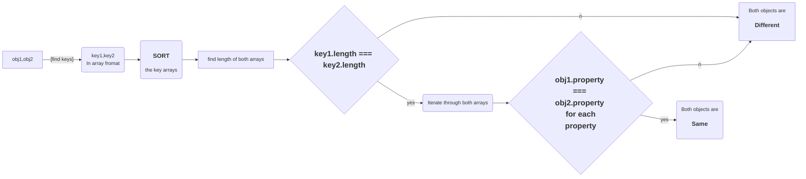
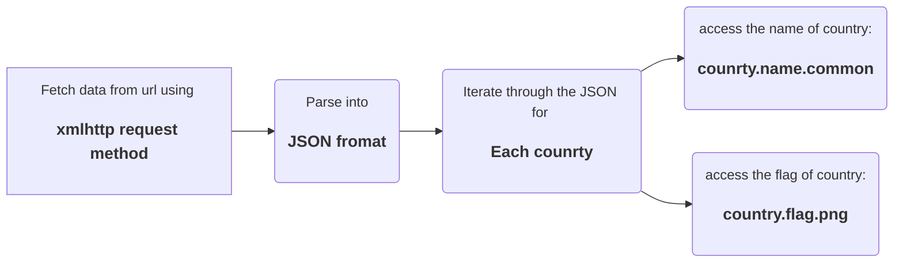
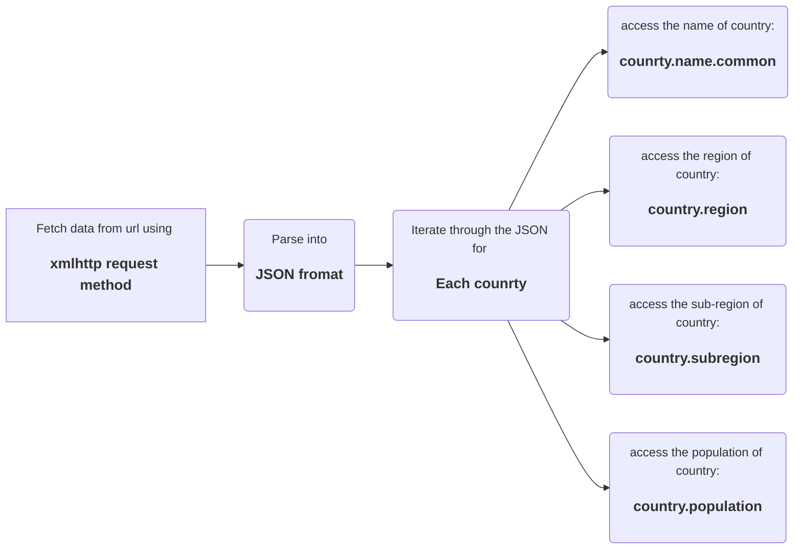

# TASK- DAY 3

### Day 3's tasks involves 3 Questions:

    Q1. To check weather two JSON objects are same without order.

    Q2. From the restcountries API print every country's
        * name &
        * flag
    in the console

    Q3. From the same API print every country's
        * name
        * region
        * sun-region
        * population

## Q1) Check properties of JSON without order

In the first question we need to check if the two objects are same without conscidering the order of porperties.

Here's a flow-chart on how to check the similarity.

## Q2) Name & flag from restcontries API

To get any data from the API we first have to request the server for the data,then the server gives the response.

  * First we have to parse the data into JSON format fro clear view
  * Then, we acces the data from JSON according to our requirement

Below is a flowchart for fetching name & flag from the JSON object

## Q2) Name, region, sub-region & population from restcontries API

To egt the above propertiues from the recieved response we follow the sam esteps that we did for Q2  
But here, we do some extra steps to get all these data
* parse the response into JSON format for clear view
* acces the properties to get our data

below is a flowchart that explains the steps followed:

