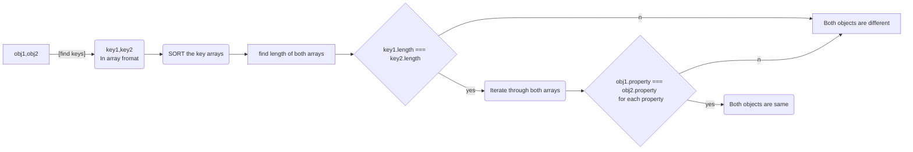

# TASK- DAY 3

### Day 3's tasks involves 3 Questions:

    Q1. To check weather two JSON objects are same without order.

    Q2. From the restcountries API print every country's
        * name &
        * flag
    in the console

    Q3. From the same API print every country's
        * name
        * region
        * sun-region
        * population

## Q1) Check properties of JSON without order

In the first question we need to check if the two objects are same without conscidering the order of porperties.

Here's a flow-chart on how to check the similarity.

